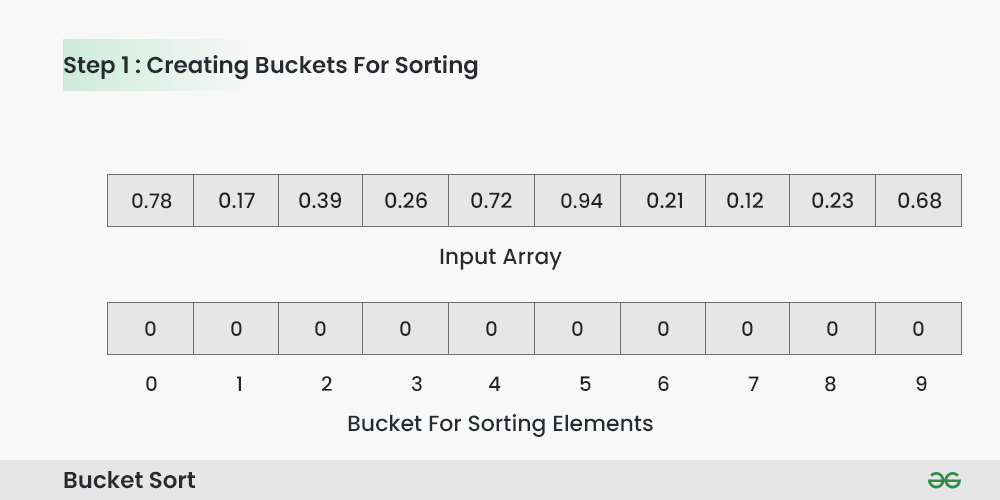
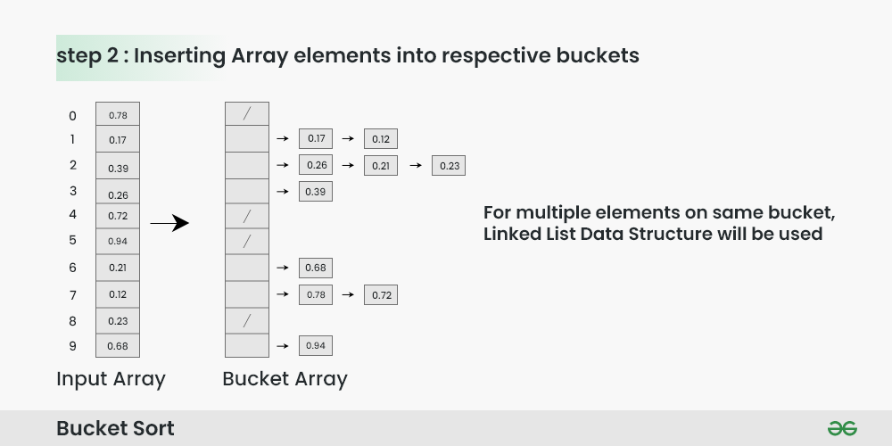
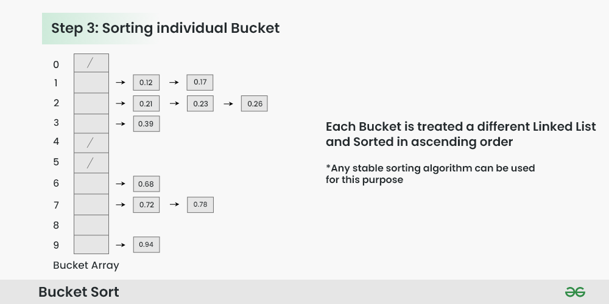
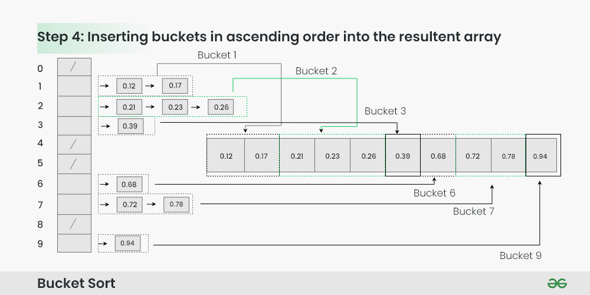
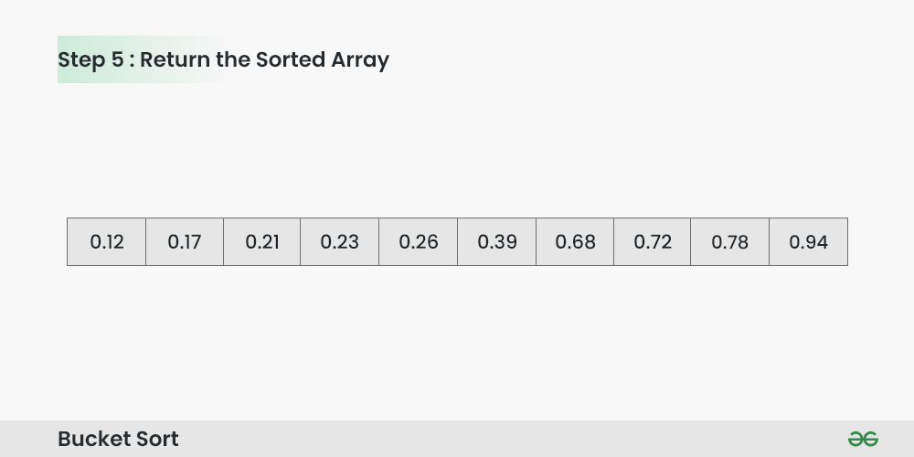

## Bin/Bucket Sort

Bucket sort is a sorting technique that involves dividing elements into various groups, or buckets. These buckets are formed by uniformly distributing the elements. Once the elements are divided into buckets, they can be sorted using any other sorting algorithm. Finally, the sorted elements are gathered together in an ordered fashion.

### Bucket Sort Algorithm:

Create n empty buckets (Or lists) and do the following for every array element `arr[i]`.
* Insert arr[i] into bucket[n*array[i]]
* Sort individual buckets using insertion sort.
* Concatenate all sorted buckets.

### How does Bucket Sort work?

To apply bucket sort on the input `array [0.78, 0.17, 0.39, 0.26, 0.72, 0.94, 0.21, 0.12, 0.23, 0.68]`, we follow these steps:

**Step 1:** Create an array of size 10, where each slot represents a bucket.



**Step 2:** Insert elements into the buckets from the input array based on their range.

Inserting elements into the buckets:

* Take each element from the input array.
* Multiply the element by the size of the bucket array (10 in this case). For example, for element 0.23, we get 0.23 * 10 = 2.3.
* Convert the result to an integer, which gives us the bucket index. In this case, 2.3 is converted to the integer 2.
* Insert the element into the bucket corresponding to the calculated index.
* Repeat these steps for all elements in the input array.



**Step 3:** Sort the elements within each bucket. In this example, we use quicksort (or any stable sorting algorithm) to sort the elements within each bucket.

Sorting the elements within each bucket:

* Apply a stable sorting algorithm (e.g., Bubble Sort, Merge Sort) to sort the elements within each bucket.
* The elements within each bucket are now sorted.



**Step 4:** Gather the elements from each bucket and put them back into the original array.

Gathering elements from each bucket:

* Iterate through each bucket in order.
* Insert each individual element from the bucket into the original array.
* Once an element is copied, it is removed from the bucket.
* Repeat this process for all buckets until all elements have been gathered.




**Step 5:** The original array now contains the sorted elements.

The final sorted array using bucket sort for the given input is `[0.12, 0.17, 0.21, 0.23, 0.26, 0.39, 0.68, 0.72, 0.78, 0.94].`



#### Code
```cpp
#include <bits/stdc++.h>
using namespace std;

struct Node
{
      int data;
      struct Node *next;
};

int findMax(vector<int> &arr, int n)
{
      int maximum=INT_MIN;
      for(int i=0;i<n;i++)
      {
            if(arr[i]>maximum)
            {
                  maximum=arr[i];
            }
      }
      return maximum;
}

void Insert(Node ** bin, int index)
{
      Node *temp=new Node;
      temp->data=index;
      temp->next=nullptr;

      if(bin[index]==nullptr)
      {
            bin[index]=temp;
      }
      else
      {
            Node *p=bin[index];
            while(p->next!=nullptr)
            {
                  p=p->next;
            }
            p->next=temp;
      }
}

int Delete(Node ** bin, int index)
{
      Node *p=bin[index];
      bin[index]=bin[index]->next;
      int x=p->data;
      delete p;
      return x;
}

void BinSort(vector<int>& arr, int n) 
{
      int maxi=findMax(arr,n);
      
      // Creating bins array
      Node **Bins=new Node *[maxi+1];
      
      // Initialize bins array with nullptr
      for(int i=0;i<maxi+1;i++)
      {
            Bins[i]=nullptr;
      }

      // update count array values based on A values
      for(int i=0;i<n;i++)
      {
            Insert(Bins,arr[i]);
      }

      // update A with Sorted Elements
      int i=0,j=0;
      while(i<maxi+1)
      {
            while(Bins[i]!=nullptr)
            {
                  arr[j++]=Delete(Bins,i);
            }
            i++;
      }

      // Delete heap memory
      delete []  Bins; 
}
void Display(vector<int> arr)
{
      for(int num: arr)
      {
            cout<<num<<" ";
      }
}
int main()
{
      vector<int> arr={3,7,9,10,6,5,12,4,11,2};
      int n=arr.size();
      cout<<"Before Sorting: "<<endl;
      Display(arr);
      BinSort(arr,n);
      cout<<endl;
      cout<<"After Sorting: "<<endl;
      Display(arr);
      return 0;
}
```

**Output**
``` 
Before Sorting: 
3 7 9 10 6 5 12 4 11 2 
After Sorting: 
2 3 4 5 6 7 9 10 11 12 

```


#### Complexity Analysis of Bin/Bucket Sort:

**Time Complexity:** O(n)

**Auxiliary Space:** O(Largest Element in a array)

