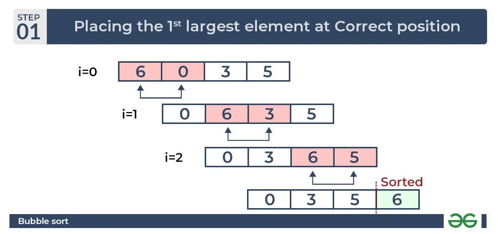
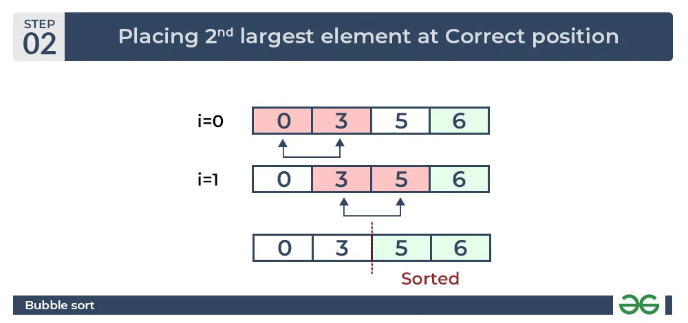
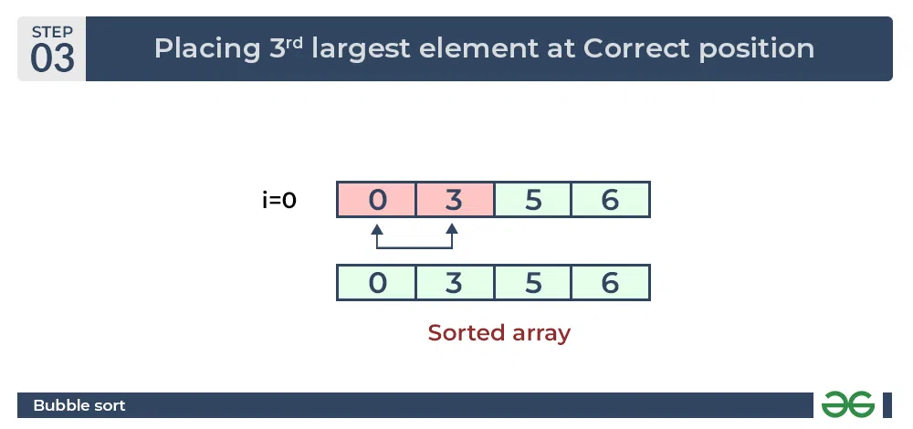

## Bubble Sort

Bubble Sort is the simplest sorting algorithm that works by repeatedly swapping the adjacent elements if they are in the wrong order. This algorithm is not suitable for large data sets as its average and worst-case time complexity is quite high.

##### Bubble Sort Algorithm
* traverse from left and compare adjacent elements and the higher one is placed at right side. 
* In this way, the largest element is moved to the rightmost end at first. 
* This process is then continued to find the second largest and place it and so on until the data is sorted.

#### How does Bubble Sort Work?

```
Input: arr[] = {6, 3, 0, 5}
```

**First Pass:** 

The largest element is placed in its correct position, i.e., the end of the array.



**Second Pass:**

Place the second largest element at correct position




**Third Pass:**

Place the remaining two elements at their correct positions.




**Total no. of passes:** `n-1`

**Total no. of comparisons:** `n*(n-1)/2`


#### Code
```cpp
#include <bits/stdc++.h>
using namespace std;
void BubbleSort(vector<int> &arr, int n)
{
      bool swapped;
      for(int i=0;i<n-1;i++)
      {
            swapped=false;
            for(int j=0;j<n-i-1;j++)
            {
                  if(arr[j]>arr[j+1])
                  {
                        swap(arr[j],arr[j+1]);
                        swapped=true;
                  }
            }
            if(swapped==false)
            {
                  break;
            }
      }
}
void Display(vector<int> arr)
{
      for(int num: arr)
      {
            cout<<num<<" ";
      }
}
int main()
{
      vector<int> arr={3,7,9,10,6,5,12,4,11,2};
      int n=arr.size();
      cout<<"Before Sorting: "<<endl;
      Display(arr);
      BubbleSort(arr,n);
      cout<<endl;
      cout<<"After Sorting: "<<endl;
      Display(arr);
      return 0;
}
```

**Output**
```
Before Sorting: 
3 7 9 10 6 5 12 4 11 2 
After Sorting: 
2 3 4 5 6 7 9 10 11 12 
```


#### Complexity Analysis of Bubble Sort:

**Time Complexity:** O(n<sup>2</sup>)

**Auxiliary Space:** O(1)

**Advantages of Bubble Sort:**
* Bubble sort is easy to understand and implement.
* It does not require any additional memory space.
* It is a stable sorting algorithm, meaning that elements with the same key value maintain their relative order in the sorted output.

**Disadvantages of Bubble Sort:**
* Bubble sort has a time complexity of O(n<sup>2</sup>) which makes it very slow for large data sets.
* Bubble sort is a comparison-based sorting algorithm, which means that it requires a comparison operator to determine the relative order of elements in the input data set. It can limit the efficiency of the algorithm in certain cases.