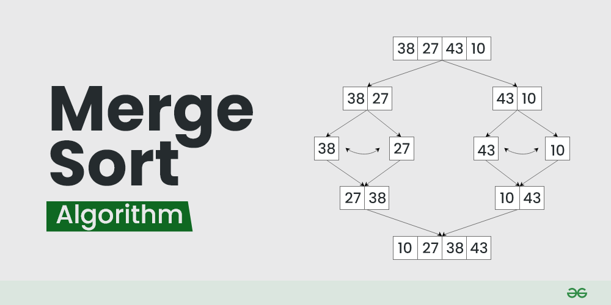
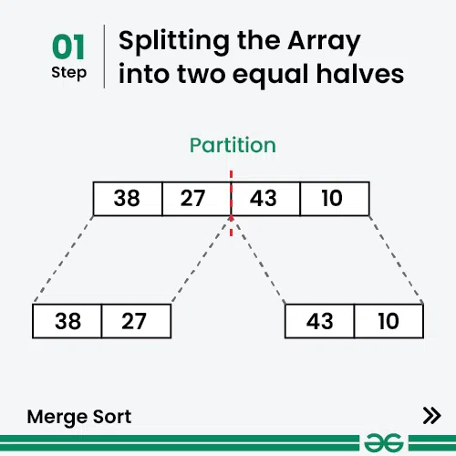
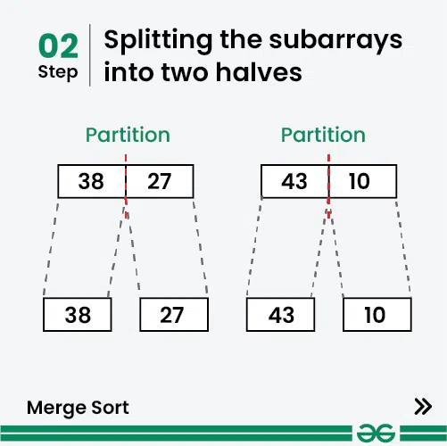
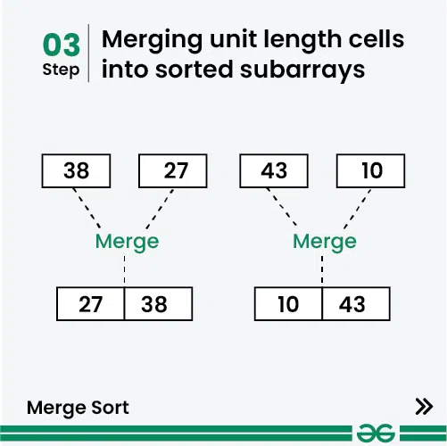
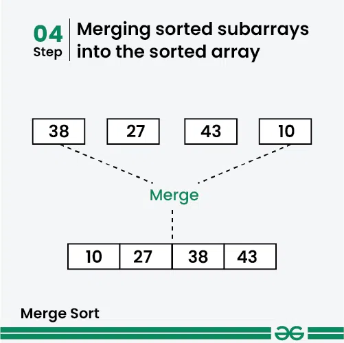

## Merge Sort

Merge sort is defined as a sorting algorithm that works by dividing an array into smaller subarrays, sorting each subarray, and then merging the sorted subarrays back together to form the final sorted array.




In simple terms, we can say that the process of merge sort is to divide the array into two halves, sort each half, and then merge the sorted halves back together. This process is repeated until the entire array is sorted.


#### How does Merge Sort work?
Merge sort is a recursive algorithm that continuously splits the array in half until it cannot be further divided i.e., the array has only one element left (an array with one element is always sorted). Then the sorted subarrays are merged into one sorted array.

See the below illustration to understand the working of merge sort.


#### Illustration:

Lets consider an array `arr[] = {38, 27, 43, 10}`

* These sorted subarrays are merged together, and we get bigger sorted subarrays.
* This merging process is continued until the sorted array is built from the smaller subarrays.
* Initially divide the array into two equal halves:
* These subarrays are further divided into two halves. Now they become array of unit length that can no longer be divided and array of unit length are always sorted.
* The following diagram shows the complete merge sort process for an example array `{38, 27, 43, 10}.` 










### Iterative Merge Sort

#### Code
```cpp
#include <bits/stdc++.h>
using namespace std;

void merge(vector<int>& arr, int low, int mid, int high) 
{
      int i=low, j=mid+1,k=low;
      int temp[high+1];
      while(i<=mid && j<=high)
      {
            if(arr[i]<arr[j])
            {
                  temp[k++]=arr[i++];
            }
            else
            {
                  temp[k++]=arr[j++];
            }
      }
      while(i<=mid)
      {
           temp[k++]=arr[i++]; 
      }
      while(j<=high)
      {
            temp[k++]=arr[j++];
      }
      for(int i=low;i<=high;i++)
      {
            arr[i]=temp[i];
      }
}


void mergeSort(vector<int>& arr, int n) 
{
      int p,i,low,mid,high;
      for(p=2;p<=n;p=p*2)
      {
            for(int i=0;i+p-1<=n;i=i+p)
            {
                  low=i;
                  high=i+p-1;
                  mid=(low+high)/2;
                  merge(arr,low,mid,high);
            }
      }
      if(p/2 < n) // For odd array list
      {
            merge(arr,0,p/2-1,n);
      }


}
void Display(vector<int> arr)
{
      for(int num: arr)
      {
            cout<<num<<" ";
      }
}
int main()
{
      // vector<int> arr={3,7,9,10,6,5,12,4,11,2};
      vector<int> arr={11,13,7,12,16,9,24,5,10,3};
      int n=arr.size();
      cout<<"Before Sorting: "<<endl;
      Display(arr);
      mergeSort(arr,n);
      cout<<endl;
      cout<<"After Sorting: "<<endl;
      Display(arr);
      return 0;
}
```

**Output**
``` 
Before Sorting: 
11 13 7 12 16 9 24 5 10 3 
After Sorting: 
3 5 7 9 10 11 12 13 16 24 
```


#### Complexity Analysis of Merge Sort:

**Time Complexity:** O(nlogn)

**Auxiliary Space:** O(n)


****

### Recursive Merge Sort

#### Code
```cpp
#include <bits/stdc++.h>
using namespace std;

void merge(vector<int>& arr, int low, int mid, int high) 
{
      int i=low, j=mid+1,k=low;
      int temp[high+1];
      while(i<=mid && j<=high)
      {
            if(arr[i]<arr[j])
            {
                  temp[k++]=arr[i++];
            }
            else
            {
                  temp[k++]=arr[j++];
            }
      }
      while(i<=mid)
      {
           temp[k++]=arr[i++]; 
      }
      while(j<=high)
      {
            temp[k++]=arr[j++];
      }
      for(int i=low;i<=high;i++)
      {
            arr[i]=temp[i];
      }
}


void mergeSort(vector<int>& arr, int low,int high) 
{
      if(low<high)
      {
            int mid=(low+high)/2;
            mergeSort(arr,low,mid);
            mergeSort(arr,mid+1,high);
            merge(arr,low,mid,high);
      }
}
void Display(vector<int> arr)
{
      for(int num: arr)
      {
            cout<<num<<" ";
      }
}
int main()
{
      // vector<int> arr={3,7,9,10,6,5,12,4,11,2};
      vector<int> arr={11,13,7,12,16,9,24,5,10,3};
      int n=arr.size();
      cout<<"Before Sorting: "<<endl;
      Display(arr);
      mergeSort(arr,0,n);
      cout<<endl;
      cout<<"After Sorting: "<<endl;
      Display(arr);
      return 0;
}
```

**Output**
``` 
Before Sorting: 
11 13 7 12 16 9 24 5 10 3 
After Sorting: 
3 5 7 9 10 11 12 13 16 24 
```


#### Complexity Analysis of Merge Sort:

**Time Complexity:** O(nlogn)

**Auxiliary Space:** O(n+logn)

