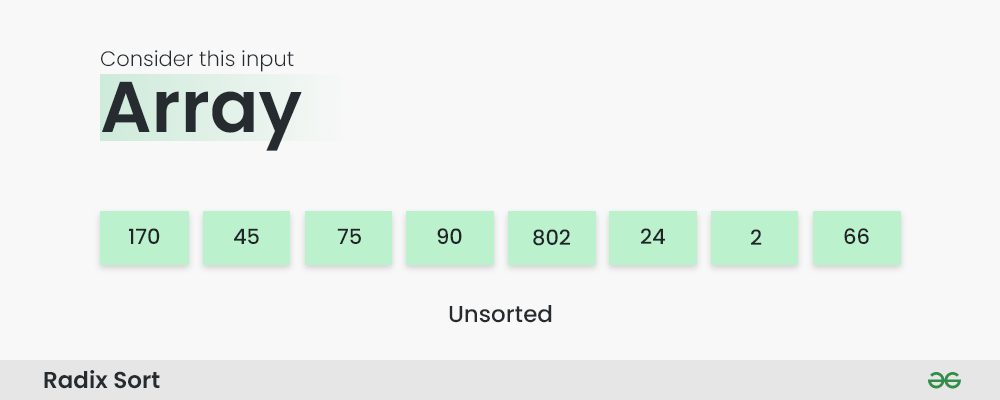
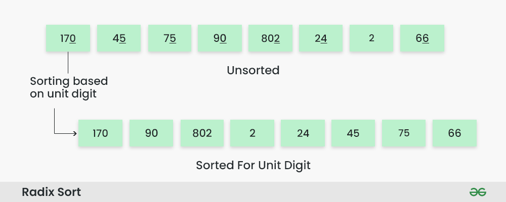
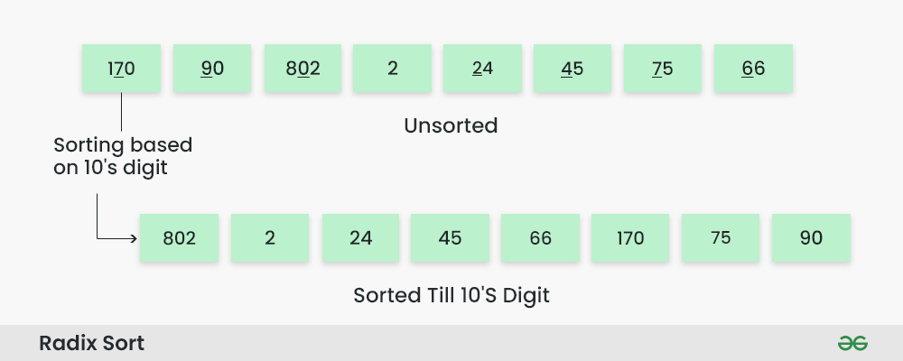
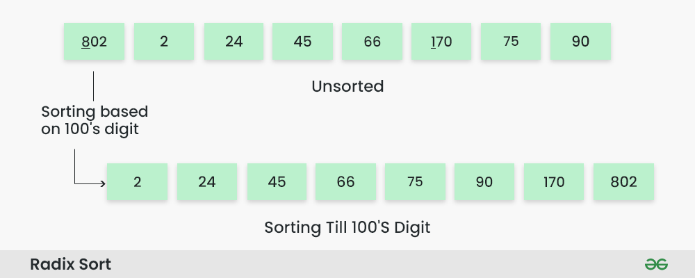
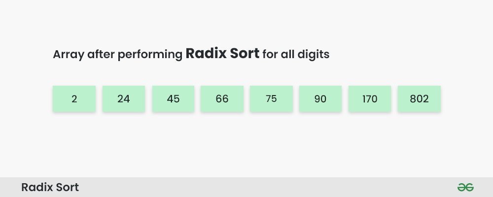

## Radix Sort

Radix Sort is a linear sorting algorithm that sorts elements by processing them digit by digit. It is an efficient sorting algorithm for integers or strings with fixed-size keys. 

Rather than comparing elements directly, Radix Sort distributes the elements into buckets based on each digit’s value. By repeatedly sorting the elements by their significant digits, from the least significant to the most significant, Radix Sort achieves the final sorted order.

### Radix Sort Algorithm
The key idea behind Radix Sort is to exploit the concept of place value. It assumes that sorting numbers digit by digit will eventually result in a fully sorted list. Radix Sort can be performed using different variations, such as Least Significant Digit (LSD) Radix Sort or Most Significant Digit (MSD) Radix Sort.

### How does Radix Sort Algorithm work?
To perform radix sort on the array `[170, 45, 75, 90, 802, 24, 2, 66]`, we follow these steps:




**Step 1:** Find the largest element in the array, which is `802`. It has three digits, so we will iterate three times, once for each significant place.

**Step 2:** Sort the elements based on the unit place digits `(X=0)`. We use a stable sorting technique, such as counting sort, to sort the digits at each significant place.

**Sorting based on the unit place:**
* Perform counting sort on the array based on the unit place digits.
* The sorted array based on the unit place is `[170, 90, 802, 2, 24, 45, 75, 66]`.




**Step 3:** Sort the elements based on the tens place digits.

**Sorting based on the tens place:**

* Perform counting sort on the array based on the tens place digits.
* The sorted array based on the tens place is `[802, 2, 24, 45, 66, 170, 75, 90]`.




**Step 4:** Sort the elements based on the hundreds place digits.

**Sorting based on the hundreds place:**

* Perform counting sort on the array based on the hundreds place digits.
* The sorted array based on the hundreds place is `[2, 24, 45, 66, 75, 90, 170, 802]`.



Step 5: The array is now sorted in ascending order.

The final sorted array using radix sort is `[2, 24, 45, 66, 75, 90, 170, 802]`.




#### Code
```cpp
#include <bits/stdc++.h>
using namespace std;

struct Node
{
      int data;
      struct Node *next;
};

int findMax(vector<int> &arr, int n)
{
      int maximum=INT_MIN;
      for(int i=0;i<n;i++)
      {
            if(arr[i]>maximum)
            {
                  maximum=arr[i];
            }
      }
      return maximum;
}

int countDigits(int x)
{
      int count=0;
      while(x!=0)
      {
            x=x/10;
            count++;
      }
      return count;
}

void initializeBins(Node **p, int n)
{
      for(int i=0;i<n;i++)
      {
            p[i]=nullptr;
      }
}

void Insert(Node ** bin, int value, int index)
{
      Node *temp=new Node;
      temp->data=value;
      temp->next=nullptr;

      if(bin[index]==nullptr)
      {
            bin[index]=temp;
      }
      else
      {
            Node *p=bin[index];
            while(p->next!=nullptr)
            {
                  p=p->next;
            }
            p->next=temp;
      }
}

int Delete(Node ** bin, int index)
{
      Node *p=bin[index];
      bin[index]=bin[index]->next;
      int x=p->data;
      delete p;
      return x;
}

int getBinIndex(int x, int index)
{
      return (int)(x/pow(10,index))%10;
}

void RadixSort(vector<int>& arr, int n) 
{
      int maxi=findMax(arr,n);
      int Passes=countDigits(maxi);

      // Creating bins array
      Node **Bins=new Node *[10];
      
      // Initialize bins array with nullptr
      initializeBins(Bins,10);

      // update bins and arr for nPass times
      for(int pass=0;pass<Passes;pass++)
      {
            // Update bins based on array value
            for(int i=0;i<n;i++)
            {
                  int binIndex=getBinIndex(arr[i],pass);
                  Insert(Bins,arr[i],binIndex);
            }

            // Update arr with sorted elements from bin
            int i=0,j=0;
            while(i<10)
            {
                  while(Bins[i]!=nullptr)
                  {
                        arr[j++]=Delete(Bins,i);
                  }
                  i++;
            }
            // Initialize bins with nullptr again
            initializeBins(Bins,10);
      }

      // Delete heap memory
      delete []  Bins; 
}
void Display(vector<int> arr)
{
      for(int num: arr)
      {
            cout<<num<<" ";
      }
}
int main()
{
      // vector<int> arr={3,7,9,10,6,5,12,4,11,2};
      vector<int> arr={237, 146, 259, 348, 152, 163, 235, 48, 36, 62};

      int n=arr.size();
      cout<<"Before Sorting: "<<endl;
      Display(arr);
      RadixSort(arr,n);
      cout<<endl;
      cout<<"After Sorting: "<<endl;
      Display(arr);
      return 0;
}
```

**Output**
``` 
Before Sorting: 
237 146 259 348 152 163 235 48 36 62 
After Sorting: 
36 48 62 146 152 163 235 237 259 348 
```


#### Complexity Analysis of Radix Sort:

**Time Complexity:** O(d*n) ~ O(n)

**Auxiliary Space:** O(n)

where **d:** the number of digit  and **n:** number of elements

