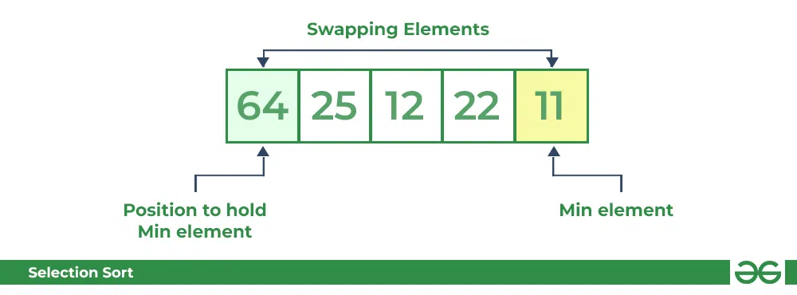
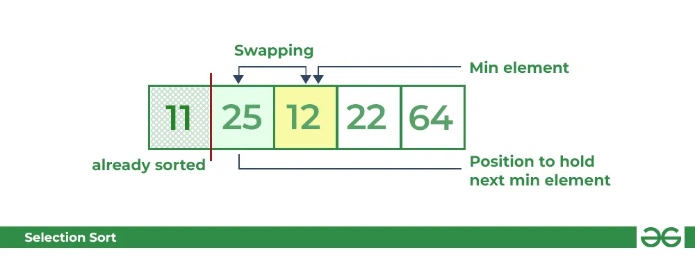
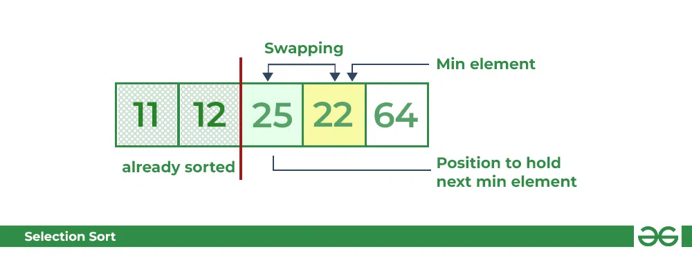
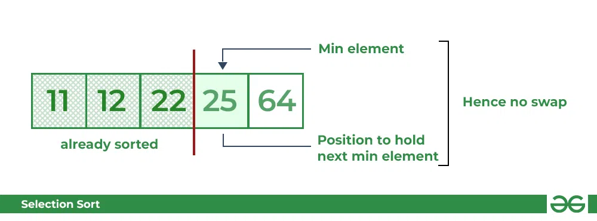

## Selection Sort

Selection sort is a simple and efficient sorting algorithm that works by repeatedly selecting the smallest (or largest) element from the unsorted portion of the list and moving it to the sorted portion of the list. 

The algorithm repeatedly selects the smallest (or largest) element from the **unsorted portion** of the list and swaps it with the **first element** of the unsorted part. This process is repeated for the **remaining unsorted portion** until the entire list is sorted. 

### How does Selection Sort Algorithm work?

Lets consider the following array as an example: `arr[] = {64, 25, 12, 22, 11}`

#### First pass:


* For the first position in the sorted array, the whole array is traversed from index 0 to 4 sequentially. The first position where 64 is stored presently, after traversing whole array it is clear that 11 is the lowest value.
* Thus, replace 64 with 11. After one iteration 11, which happens to be the least value in the array, tends to appear in the first position of the sorted list.




#### Second Pass:

* For the second position, where 25 is present, again traverse the rest of the array in a sequential manner.
* After traversing, we found that 12 is the second lowest value in the array and it should appear at the second place in the array, thus swap these values.



#### Third Pass:

* Now, for third place, where 25 is present again traverse the rest of the array and find the third least value present in the array.
* While traversing, 22 came out to be the third least value and it should appear at the third place in the array, thus swap 22 with element present at third position.



#### Fourth pass:

* Similarly, for fourth position traverse the rest of the array and find the fourth least element in the array 
* As 25 is the 4th lowest value hence, it will place at the fourth position.



#### Fifth Pass:

* At last the largest value present in the array automatically get placed at the last position in the array
* The resulted array is the sorted array.


#### Code
```cpp
#include <bits/stdc++.h>
using namespace std;
void SelectionSort(vector<int> &arr, int n)
{
      int i,j,k;
      for(i=0;i<n-1;i++)
      {
            for(j=k=i;j<n;j++)
            {
                  if(arr[j]<arr[k])
                  {
                        k=j;
                  }
            }
            swap(arr[i],arr[k]);
      }
}
void Display(vector<int> arr)
{
      for(int num: arr)
      {
            cout<<num<<" ";
      }
}
int main()
{
      vector<int> arr={3,7,9,10,6,5,12,4,11,2};
      int n=arr.size();
      cout<<"Before Sorting: "<<endl;
      Display(arr);
      SelectionSort(arr,n);
      cout<<endl;
      cout<<"After Sorting: "<<endl;
      Display(arr);
      return 0;
}
```

**Output**
```
Before Sorting: 
3 7 9 10 6 5 12 4 11 2 
After Sorting: 
2 3 4 5 6 7 9 10 11 12 
```


#### Complexity Analysis of Selection Sort:

**Time Complexity:** O(n<sup>2</sup>)

**Auxiliary Space:** O(1)


**Advantages of Selection Sort Algorithm**
* Simple and easy to understand.
* Works well with small datasets.


**Disadvantages of the Selection Sort Algorithm**

* Selection sort has a time complexity of O(n^2) in the worst and average case.
* Does not work well on large datasets.
* Does not preserve the relative order of items with equal keys which means it is not stable.