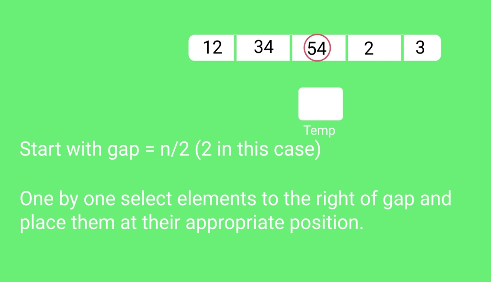
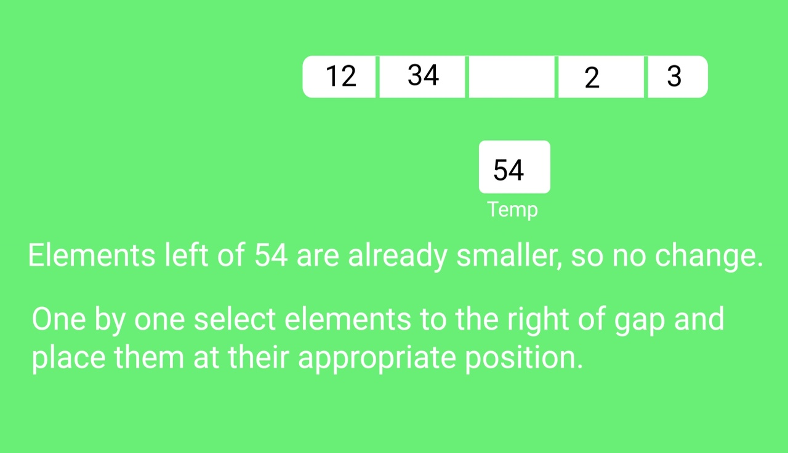
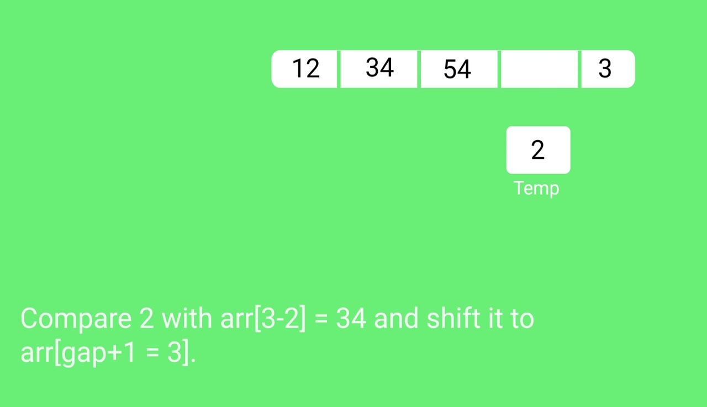
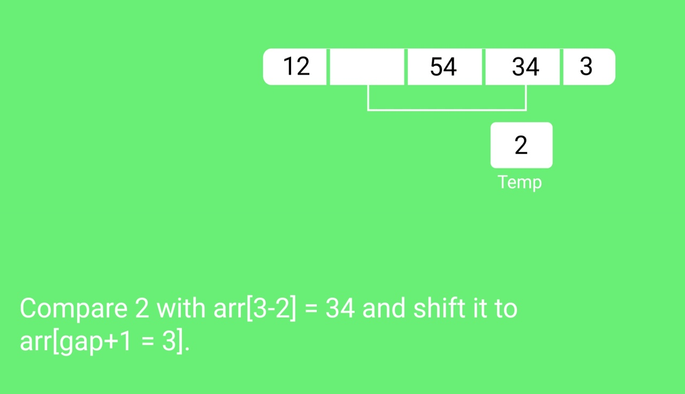
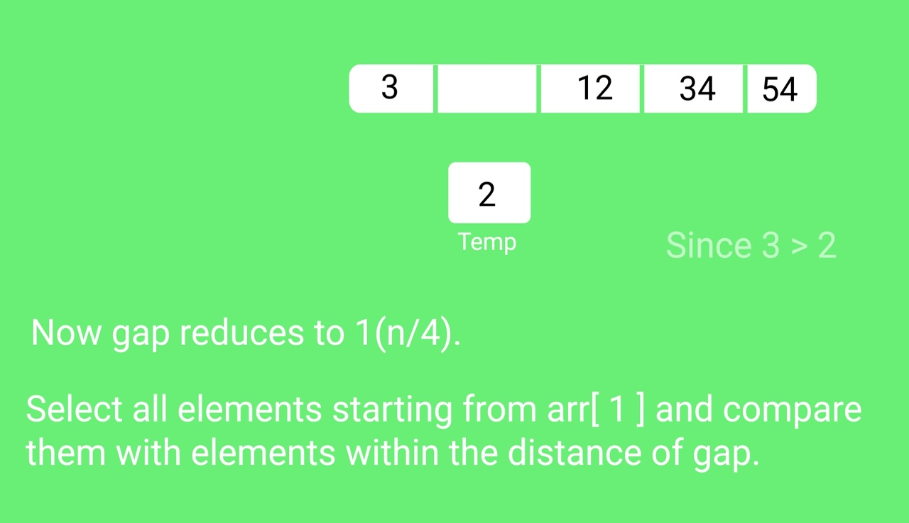
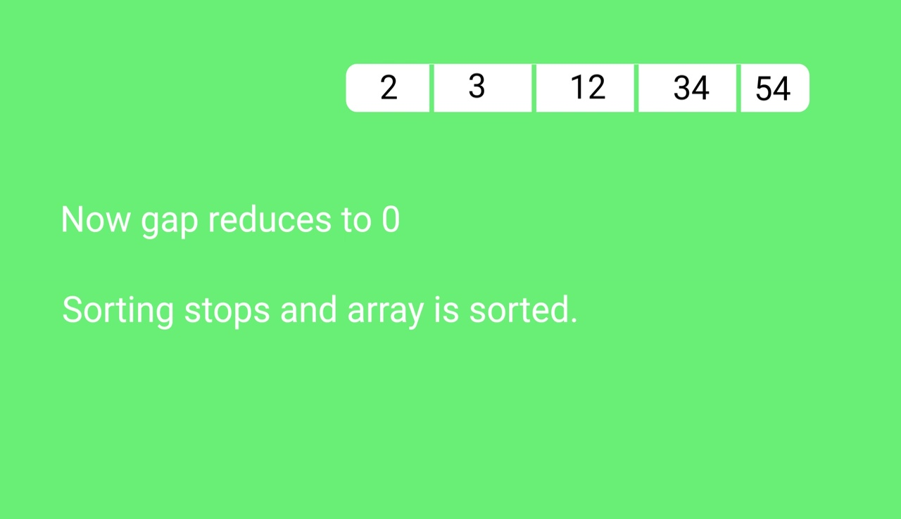

## Shell Sort

Shell sort is mainly a variation of Insertion Sort. In insertion sort, we move elements only one position ahead. When an element has to be moved far ahead, many movements are involved. The idea of ShellSort is to allow the exchange of far items. In Shell sort, we make the array h-sorted for a large value of h. We keep reducing the value of h until it becomes 1. An array is said to be h-sorted if all sublists of every h’th element are sorted.

### Algorithm:

**Step 1** − Start

**Step 2** − Initialize the value of gap size, say h.

**Step 3** − Divide the list into smaller sub-part. Each must have equal intervals to h.

**Step 4** − Sort these sub-lists using insertion sort.

**Step 5** – Repeat this step 2 until the list is sorted.

**Step 6** – Print a sorted list.

**Step 7** – Stop.

### Snapshots:















#### Code
```cpp
#include <bits/stdc++.h>
using namespace std;

void ShellSort(vector<int>& arr, int n) 
{
      int temp,j;
      for(int gap=n/2;gap>=1;gap/=2)
      {
            for(int i=gap;i<n;i++)
            {
                  temp=arr[i];
                  j=i-gap;
                  while(j>=0 && arr[j]>temp)
                  {
                        arr[j+gap]=arr[j];
                        j=j-gap;
                  }
                  arr[j+gap]=temp;
            }
      }
}
void Display(vector<int> arr)
{
      for(int num: arr)
      {
            cout<<num<<" ";
      }
}
int main()
{
      vector<int> arr={3,7,9,10,6,5,12,4,11,2};
      int n=arr.size();
      cout<<"Before Sorting: "<<endl;
      Display(arr);
      ShellSort(arr,n);
      cout<<endl;
      cout<<"After Sorting: "<<endl;
      Display(arr);
      return 0;
}
```

**Output**
``` 
Before Sorting: 
3 7 9 10 6 5 12 4 11 2 
After Sorting: 
2 3 4 5 6 7 9 10 11 12 
```


#### Complexity Analysis of Shell Sort:

**Time Complexity:** O(nlogn) or O(n<sup>3/2</sup>) or O(n<sup>5/3</sup>)

**Auxiliary Space:** O(1)

